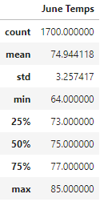
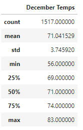

# Surf's Up with Advanced Data Storage and Retrieval

## Project Overview

W. Avy, an investor that we reached out to, is inquirying about a weather analysis for Oahu, Hawaii where we plan to open our surf and ice cream shop. A surf and ice cream shop relies heavily on nice, warm weather to ensure the business is successful. Using Python, Pandas functions and methods, and SQLAlchemy, we generated a list of all measured temperature data for the months of June and December. Using our lists and converting them to dataframes, we determined the summary statistics, as requested by W. Avy.

 
## Results
With our June and December summaries generated, we found several key differences:
 
1. We had slightly more weather data for the month of June compared to December, 1700 observations verse 1517.

2. The minimum temperatures were less than 10 degrees apart from each other. The minimum temperature for June was 64 and 56 in December

3. The maximum temperatures were very close despite the season and time of year. In June, temperatures reached 85 degrees and in December they reached 83 degrees.
  

 

 
## Summary & Conclusion

Although our weather analysis was focused on June and December, opposite months in two different seasons, the temperatures were close together. The lowest temperature was 56 degrees which may forsee less customers than in warmer conditions. However, in 56 degree weather, we can still see customers stop by. Oahu would be a great location to open shop according to our analysis.

Some additional queries we may perform to solidify our decision and to minimize any doubt W. Avy has with his investment is to run analysis on other months of the year, to include November and January, as well as May and July. January may, in some years, be colder than December so it would be best practice to look at the bordering months' weather data.

Another query we can look into is to determine day/night weather data to help optimize our hours of operations.

Lastly, we can look at precipitation data to determine which months are likely to rain out any surfing in the area, leading to decreased foot traffic and customers to our shop.
